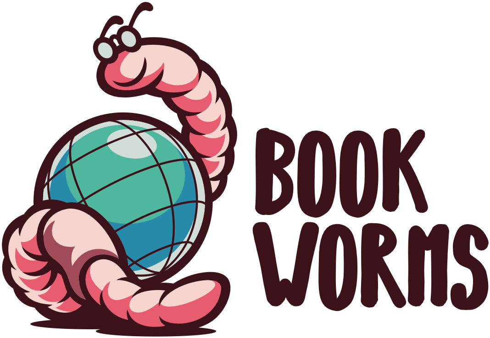

<p align="center">
  <a href="https://www.jamesbarryillustration.com/">
    
  </a>
</p>

> Centralise your bookmarks as `YAML` configuration and export files that can be used in your projects or imported into your browser.

In a large company there are literally thousands of tools, environments and HR system URLs to remember. In a start up there maybe many less but in both scenarios there is probably no authority of truth and if there is, it is often out of date.

This tool is designed to help teams share URLs, keep them updo date and consistent in their tools of choice.

_Read more about the motivations behind this project here: [How I centralize and distribute my bookmarks](https://medium.com/@robinglen/how-i-centralize-and-distribute-my-bookmarks-cc8b11bb7475)._

## Getting started

First thing you need to do is create your bookmarks `YAML` configuration, below is an example:

```YAML
label: Bookworms
description: These are sample bookmarks to teach you how Bookworms works
folders:
  - label: folder 1
    description: This is to describe the folder structure
    folders:
      - label: sub folder 1
        description: This is to describe the sub folder structure
        bookmarks:
          - label: sample url 1
            description: this is used to describe the bookmark
            href: https://www.mywebsite.com
  - label: folder 2
    folders:
      - label: sub folder 2
        bookmarks:
          - label: sample url 2
            description: this is used to describe the bookmark
            href: https://www.mywebsite.com
          - label: sample url 3
            description: this is used to describe the bookmark
            href: https://www.mywebsite.com
      - label: sub folder 3
        bookmarks:
          - label: sample url 4
            description: this is used to describe the bookmark
            href: https://www.mywebsite.com
          - label: sample url 5
            description: this is used to describe the bookmark
            href: https://www.mywebsite.com
```

- `label` - The heading of your bookmarks or the folder
- `description` - Generates a `HTML` comment or text within `markdown`
- `folders` - A way of grouping together bookmarks, you can nest these as deep as you like
- `bookmarks` - How you group the information for a bookmark link
- `href` - The URL you want to bookmark

If you already have bookmarks in your browser you can speed up the process of converting them into `YAML` using the `convert` tool, read more about that here:
[Exporting existing bookmarks](./docs/EXPORTING-EXISTING-BOOKMARKS.md).

Once this is ready you can pass it to Bookworms using [`npx`](https://nodejs.dev/learn/the-npx-nodejs-package-runner).

```BASH
$ npx bookworms get ./my-bookmarks.yaml
```

This will then generate in the `./` directory the different exports you can then use in your older tools.

```BASH
$ cd output
$ ls
browsers.html README.md
```

To fetch bookmarks from a remote location just use a standard `http` URL:

```BASH
$ npx bookworms get https://raw.githubusercontent.com/thearegee/bookworms/main/demo/config/bookmarks.yaml
```

Now you can import the `browsers.html` to display your bookmarks in your browser or the `README.md` into your projects, for more information on how to use these files see [Using your bookmarks](./docs/USING-YOUR-BOOKMARKS.md) or if you want to see other options available to you see [Advanced usage](./docs/ADVANCED-USAGE.md).

## Help

If you need help using Bookworms you can run this command:

```Bash
$ npx bookworms --help
```

If you want to understand more about Bookworms you can read the following:

- [Advanced usage](./docs/ADVANCED-USAGE.md)
- [Using your bookmarks](./docs/USING-YOUR-BOOKMARKS.md)
- [Exporting existing bookmarks](./docs/EXPORTING-EXISTING-BOOKMARKS.md)
- [For developers](./docs/DEVELOPERS.md)

## Todo

- Test `convert` with browsers other than Chrome
- Improve documentation for using bookworms modules
- Allow users to select the exports they want or won't want
- Set up GitHub actions for repo to build, test and publish in NPM

### Future

- A way to state who owns a certain tool, if someone needs to get access to it
- Create GitHub action to update bookmark repos without `npx`
- Remove step for people to need to import files in browser
- Add the idea of public bookmarks which could generate trends
- Investigate a chrome extension that could load remote YAML files
- Document Murphy Slackbot that uses Bookworms

## Credits

The Bookworms logo was created by [James Barry Illustrations](https://www.jamesbarryillustration.com/).
